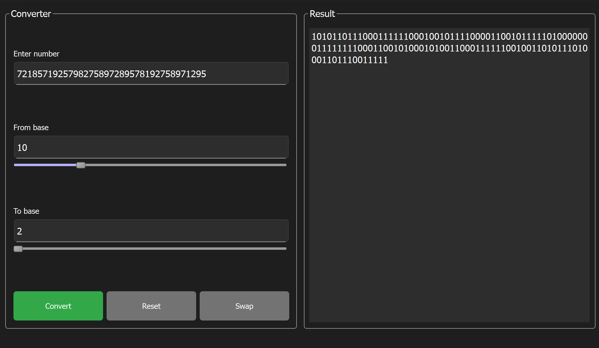
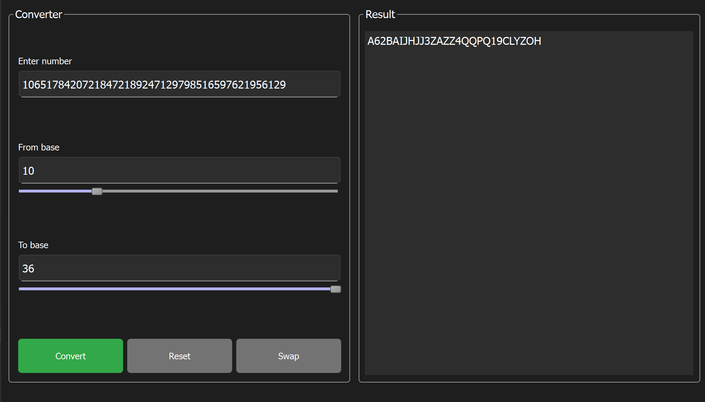
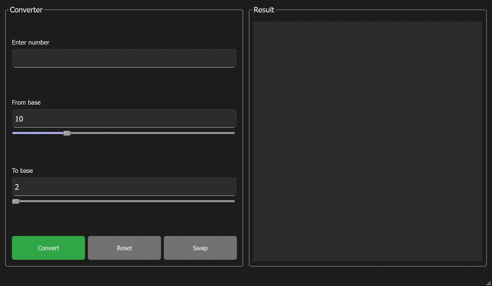

# Base Converter (Qt C++)

**Base Converter** is a fast and accurate desktop application for converting numbers between numeral systems with bases ranging from **2 to 36**. The application supports **arbitrary-length numbers** through a custom implementation of **long arithmetic**, allowing it to handle values far beyond the range of standard C++ data types.

  
  

  

---

## 🚀 Features

- 🔢 Convert numbers between bases **2 to 36**
- 🧮 Supports **very large numbers** using custom long arithmetic (BigInteger-like)
- ⚡ **High performance**, even with massive inputs
- 🎛️ Intuitive, clean Qt GUI
- ✅ Real-time validation and instant conversion

---

## 🛠️ Technologies Used

- **C++17**
- **Qt Framework** (tested with Qt 6.5)
- Custom implementation of base conversion and long arithmetic

---
